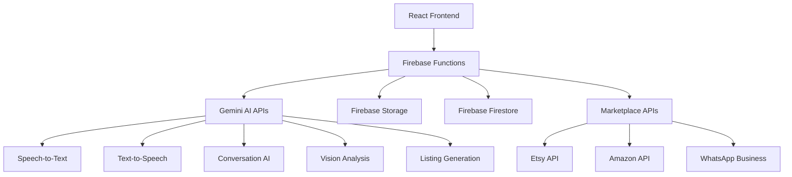
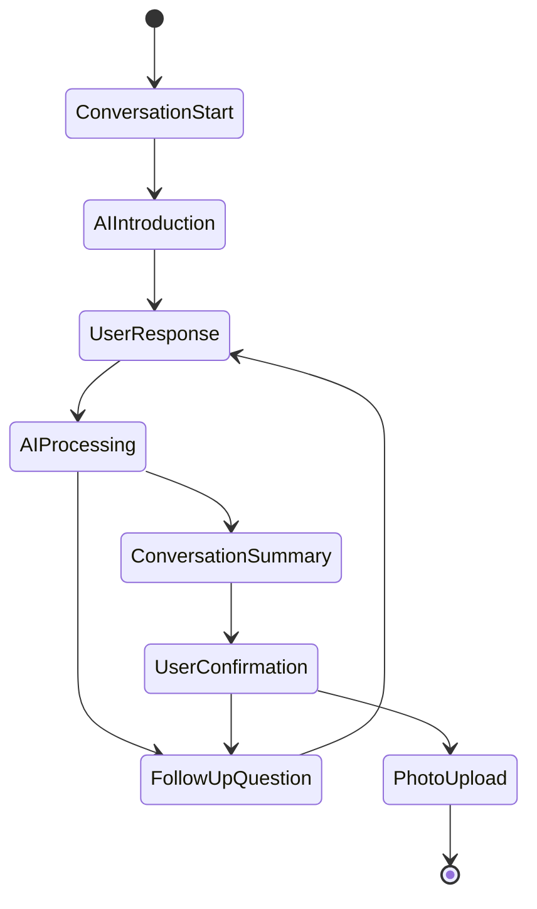

# Design Document

## Overview

The Kalakar AI Artisan Marketplace will be redesigned to feature an interactive conversational interface that gathers comprehensive product information through natural voice interactions. The system will use Gemini AI for speech-to-text, text-to-speech, and intelligent conversation management to create rich product listings for marketplace export.

## Architecture

### High-Level Architecture



### Conversation Flow Architecture



## Components and Interfaces

### Frontend Components

#### 1. ConversationInterface Component
```typescript
interface ConversationInterfaceProps {
  selectedLanguage: Language;
  onConversationComplete: (conversationData: ConversationData) => void;
  onBack: () => void;
}

interface ConversationState {
  isListening: boolean;
  isAISpeaking: boolean;
  isProcessing: boolean;
  conversationHistory: ConversationTurn[];
  currentQuestion: string;
  conversationSummary: ProductInfo | null;
}
```

#### 2. VoiceControls Component
```typescript
interface VoiceControlsProps {
  isListening: boolean;
  isAISpeaking: boolean;
  onStartListening: () => void;
  onStopListening: () => void;
  onStopAISpeaking: () => void;
}
```

#### 3. ConversationHistory Component
```typescript
interface ConversationHistoryProps {
  conversationHistory: ConversationTurn[];
  isProcessing: boolean;
}
```

#### 4. ConversationSummary Component
```typescript
interface ConversationSummaryProps {
  productInfo: ProductInfo;
  onConfirm: () => void;
  onEdit: (field: string) => void;
}
```

### Backend Functions

#### 1. Conversation Management Function
```typescript
export const manageConversation = functions.https.onCall(async (data, context) => {
  // Handles conversation flow, question generation, and context management
});
```

#### 2. Speech Processing Functions
```typescript
export const processUserSpeech = functions.https.onCall(async (data, context) => {
  // Converts speech to text and extracts intent
});

export const generateAISpeech = functions.https.onCall(async (data, context) => {
  // Converts AI questions to speech in user's language
});
```

#### 3. Conversation Intelligence Function
```typescript
export const generateFollowUpQuestion = functions.https.onCall(async (data, context) => {
  // Analyzes conversation context and generates relevant follow-up questions
});
```

## Data Models

### ConversationTurn
```typescript
interface ConversationTurn {
  id: string;
  type: 'ai_question' | 'user_response';
  content: string;
  audioUrl?: string;
  timestamp: Date;
  language: string;
  processingTime?: number;
}
```

### ConversationData
```typescript
interface ConversationData {
  id: string;
  userId: string;
  language: Language;
  turns: ConversationTurn[];
  extractedInfo: ProductInfo;
  status: 'in_progress' | 'completed' | 'abandoned';
  startedAt: Date;
  completedAt?: Date;
  summary: string;
}
```

### ProductInfo
```typescript
interface ProductInfo {
  productType: string;
  materials: string[];
  dimensions?: {
    length?: number;
    width?: number;
    height?: number;
    weight?: number;
    unit: string;
  };
  colors: string[];
  craftingProcess: string;
  culturalSignificance?: string;
  timeToMake?: string;
  pricing?: {
    cost: number;
    currency: string;
    factors: string[];
  };
  targetMarket?: string;
  uniqueFeatures: string[];
  careInstructions?: string;
  customizationOptions?: string[];
}
```

### AIQuestionContext
```typescript
interface AIQuestionContext {
  conversationId: string;
  currentInfo: Partial<ProductInfo>;
  missingFields: string[];
  lastUserResponse: string;
  questionHistory: string[];
  conversationStage: 'introduction' | 'basic_info' | 'details' | 'pricing' | 'summary';
}
```

## Conversation Intelligence System

### Question Generation Strategy

#### 1. Conversation Stages
```typescript
enum ConversationStage {
  INTRODUCTION = 'introduction',
  BASIC_INFO = 'basic_info',
  MATERIALS_CRAFTING = 'materials_crafting',
  CULTURAL_SIGNIFICANCE = 'cultural_significance',
  PRICING_MARKET = 'pricing_market',
  FINAL_DETAILS = 'final_details',
  SUMMARY = 'summary'
}
```

#### 2. Question Templates by Stage
```typescript
const QUESTION_TEMPLATES = {
  [ConversationStage.INTRODUCTION]: [
    "Hello! I'm here to help you create a beautiful listing for your handmade product. Can you start by telling me what you've made?",
    "Welcome! I'd love to learn about your craft. What product would you like to create a listing for today?"
  ],
  [ConversationStage.BASIC_INFO]: [
    "That sounds wonderful! Can you tell me more about what materials you used to make this?",
    "How big is your {productType}? Can you describe its size or dimensions?",
    "What colors do you see in your {productType}?"
  ],
  [ConversationStage.MATERIALS_CRAFTING]: [
    "How did you make this {productType}? Can you walk me through your crafting process?",
    "Where do you source your {materials} from?",
    "How long does it typically take you to create one {productType}?"
  ],
  [ConversationStage.CULTURAL_SIGNIFICANCE]: [
    "Does this {productType} have any cultural or traditional significance?",
    "Is this based on any traditional Indian art form or technique?",
    "What inspired you to create this particular design?"
  ],
  [ConversationStage.PRICING_MARKET]: [
    "What do you think would be a fair price for this {productType}?",
    "Who do you think would love to buy this {productType}?",
    "Have you sold similar items before? What was the response?"
  ]
};
```

### Context-Aware Question Selection

#### 1. Information Gap Analysis
```typescript
interface InformationGaps {
  critical: string[];  // Must-have information
  important: string[]; // Should-have information
  nice_to_have: string[]; // Could-have information
}

const analyzeInformationGaps = (productInfo: Partial<ProductInfo>): InformationGaps => {
  // Analyze what information is missing and prioritize questions
};
```

#### 2. Dynamic Question Generation
```typescript
const generateContextualQuestion = async (context: AIQuestionContext): Promise<string> => {
  const prompt = `
  Based on this conversation context, generate the most relevant follow-up question:
  
  Current Product Info: ${JSON.stringify(context.currentInfo)}
  Missing Fields: ${context.missingFields.join(', ')}
  Last Response: ${context.lastUserResponse}
  Conversation Stage: ${context.conversationStage}
  
  Generate a natural, conversational question that will help gather the most important missing information.
  Make it culturally appropriate for Indian artisans and encouraging.
  `;
  
  // Call Gemini AI to generate contextual question
};
```

## Speech Processing System

### Speech-to-Text Implementation
```typescript
const processSpeechToText = async (audioBlob: Blob, language: string): Promise<string> => {
  // Use Gemini AI for multilingual speech recognition
  const model = genAI.getGenerativeModel({ model: "gemini-1.5-pro" });
  
  const prompt = `
  Transcribe this audio in ${language} language. 
  If the speech contains product-related information, extract key details.
  Provide both transcription and extracted information.
  `;
  
  // Process audio with Gemini
};
```

### Text-to-Speech Implementation
```typescript
const generateAISpeech = async (text: string, language: string): Promise<Blob> => {
  // Use Web Speech API or Google Cloud TTS for multilingual speech synthesis
  const utterance = new SpeechSynthesisUtterance(text);
  utterance.lang = getLanguageCode(language);
  
  // Return audio blob for playback
};
```

## Error Handling

### Conversation Error Recovery
```typescript
interface ConversationError {
  type: 'speech_recognition' | 'ai_processing' | 'network' | 'audio_playback';
  message: string;
  recoverable: boolean;
  retryAction?: () => void;
}

const handleConversationError = (error: ConversationError): void => {
  switch (error.type) {
    case 'speech_recognition':
      // Show "I didn't catch that, could you repeat?" message
      // Offer text input as fallback
      break;
    case 'ai_processing':
      // Show "Let me think about that..." message
      // Implement retry with exponential backoff
      break;
    case 'network':
      // Save conversation state locally
      // Show offline message with retry option
      break;
    case 'audio_playback':
      // Fall back to text display
      // Offer manual audio controls
      break;
  }
};
```

### State Persistence
```typescript
const saveConversationState = async (conversationData: ConversationData): Promise<void> => {
  // Save to Firebase Firestore
  // Also save to localStorage as backup
};

const restoreConversationState = async (conversationId: string): Promise<ConversationData | null> => {
  // Try Firebase first, fall back to localStorage
};
```

## Testing Strategy

### Unit Testing
- **Conversation Logic**: Test question generation algorithms
- **Speech Processing**: Mock audio processing functions
- **Data Extraction**: Test information extraction from user responses
- **Error Handling**: Test all error scenarios and recovery mechanisms

### Integration Testing
- **End-to-End Conversation Flow**: Test complete conversation from start to finish
- **Multilingual Support**: Test conversations in all supported languages
- **Firebase Integration**: Test data persistence and retrieval
- **API Integration**: Test Gemini AI API calls and responses

### User Experience Testing
- **Conversation Naturalness**: Test if AI questions feel natural and relevant
- **Response Understanding**: Test if AI correctly interprets user responses
- **Cultural Sensitivity**: Test cultural appropriateness of questions and responses
- **Mobile Experience**: Test voice interactions on mobile devices

## Performance Considerations

### Conversation Response Time
- **Target**: AI responses within 2-3 seconds
- **Speech Processing**: Optimize audio encoding and transmission
- **Question Generation**: Cache common question patterns
- **Context Management**: Efficient conversation state management

### Audio Quality
- **Recording Quality**: Implement noise reduction and audio enhancement
- **Playback Quality**: Ensure clear AI speech synthesis
- **Bandwidth Optimization**: Compress audio data for transmission
- **Offline Capability**: Cache essential conversation data

### Scalability
- **Concurrent Conversations**: Support multiple simultaneous conversations
- **Firebase Limits**: Optimize database queries and storage usage
- **API Rate Limits**: Implement intelligent request batching and caching
- **Resource Management**: Efficient memory and CPU usage for audio processing

## Security Considerations

### Audio Data Protection
- **Encryption**: Encrypt audio data in transit and at rest
- **Temporary Storage**: Minimize audio data retention
- **User Consent**: Clear consent for audio recording and processing
- **Data Deletion**: Implement user right to delete conversation data

### API Security
- **Authentication**: Secure Firebase function calls
- **Rate Limiting**: Prevent API abuse
- **Input Validation**: Sanitize all user inputs
- **Error Information**: Avoid exposing sensitive error details

This design provides a comprehensive foundation for implementing the conversational voice interface while maintaining the existing photo upload and marketplace export functionality.